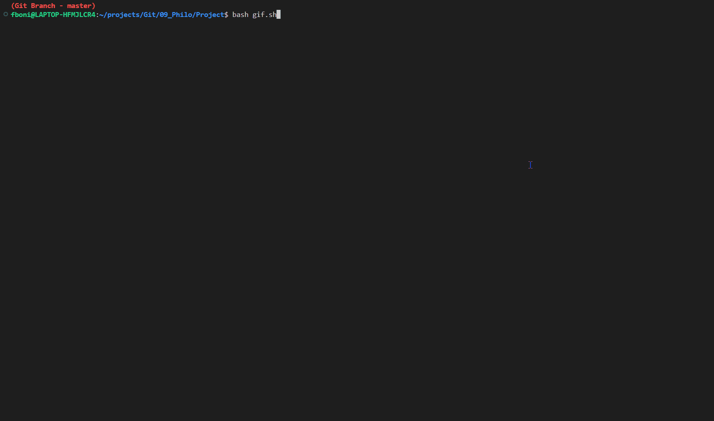

# Philosophers Dinner

<h1 name ="content" align = "center">📋 Table of contents</h1>
<p align = "center">
  <a href = "#intro">Intro</a> -
  <a href = "#goal">Goal</a> -
  <a href = "#tec">Tecnology</a> -
  <a href = "#function">Functionality</a> -
  <a href = "#how">How to use</a> -
  <a href = "#update">Update</a> -
  <a href = "#author">Author</a>
</p>

<a name="intro"/> <h2> Intro </h2> </a>
- This is a project about sharing resources.
- On this project I learned about threads, mutex, data racing and about semaphores.
- The concept of the dinner is used to show how threads can share resources and how to have control of what each thread is doing.
- The code does not use semaphores and the logic would have to change tu use it, once it uses process. But I learned how they work and how I would have to do.
<p></p>
<a href = "#content">📋</a>

<a name="goal"/> <h2> 🎯 Goal </h2> </a>
- The dinner happens on a round table.
- Each thread will be a philosopher.
- Each philosopher has a fork.
- To eat, each philosopher needs its own fork and the fork of the next philosopher. And the last philosopher uses its own fork and the fork of the first philosopher.
- Each philosopher needs to eat, sleep, think.
- If a philosopher cannot eat before the time to eat ends, the philoshper dies and the dinner is over. The time to eat is reseted after every meal.
- If all philosophers eat the times they need the dinner is over.
- If there is no limit of how many times they need to eat, the dinner will not end if the philosophers are always able to eat before the time.
- Mutexes will be used to lock resources, avoiding data racing and making sure each philosopher is doing the right action.
- One extra thread is used to control the dinner from outside the table, checking every time if any philoshopher died or if they all ate the meals needed. If yes, it will set the dinner to finished.
- Before doing the actions, the philosophers are checking if the dinner is finished or not.
- All the philosphers actions are printed on the terminal with the current dinner timer in miliseconds and the philosopher number.
- To make sure the philosophers are able to take the forks they need, the even numbers philosophers (1,3,5....) are delayed a little in the beginning, so the even numbers (2,4,6...) can take the forks they need and put back for the other philosophers, during the time they are thinking and sleeping.

- With semaphores the idea will be different, where all the forks will be in the center of the table and whoever gets two can go eat. But the other rules of the dinner are the same.
<p></p>
<a href = "#content">📋</a>

<a name="tec"/> <h2> 🛠️ Tecnology </h2> </a>
- Language: C
- VS code
- WSL ubuntu
- Norminette 42 (code norm used by école 42)
<p></p>
<a href = "#content">📋</a>

<a name="function"/> <h2> 📚 Functionality </h2> </a>



<p></p>
<a href = "#content">📋</a>

<a name="how"/> <h2> 📖 How to use </h2> </a>

- Clone the repository
```bash
git clone https://github.com/GitFlaviobc/philosophers.git
```
- to create the philosophers (Inside Project folder)
```bash
make
```
or
```bash
make all
```
- to delete all obj (.o) files created
```bash
make clean
```
 - to delete all created files
```bash
make fclean
```
 - to delete all files and recreate the push_swap
```bash
make re
```
- Args:  number_of_philosophers time_to_die time_to_eat time_to_sleep [number_of_times_each_philosopher_must_eat] 
```bash
# The result and order of action will change depending on the machine used to test
# No death No Infnite loop
./philo 3 100 4 2 2
# No Death with Inifite Loop
./philo 3 100 4 2
# One philo dies
./philo 4 8 5 2 1
```
<p></p>
<a href = "#content">📋</a>

<a name="update"/> <h2> 🆙 Updates </h2> </a>
⚠️🚧
<p></p>
<a href = "#content">📋</a>

<a name="author"/> <h2> 😀 Author </h2> </a>
Name: Flávio Bonini Campos
<p></p>

[](https://www.linkedin.com/in/flaviobc88/)
<p></p>
<a href = "#content">📋</a>
<p></p>
